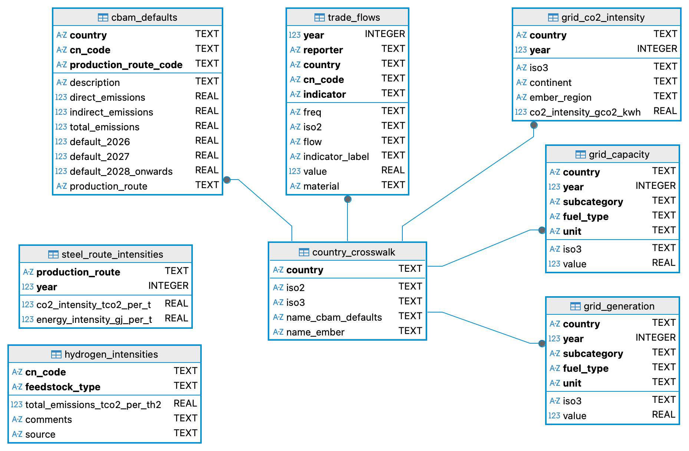

# CBAM Exposure: What Actually Moves an Importer's Carbon Bill

*CBAM costs, export exposure, and savings potential across 119 economies and the six covered sectors. 2024 data.*

## Bottom line

For a European importer of CBAM goods like steel and aluminum, the biggest single lever on the carbon bill is not switching supplier countries, and it is not re-engineering how the metal is made. It is getting the suppliers you already use to report verified actual emissions instead of defaulting to CBAM's default values. That gap holds across every one of the 119 economies in the analysis, and it survives a wide range of certificate prices. Switching countries does not move the needle the way you would expect. The decision that actually matters sits one level down, at the individual supplier.

## The decision

CBAM puts a price on the carbon embedded in imported goods across six sectors, steel and aluminum among them. On 2024 trade that works out to an estimated €15.55B globally, around 206 MtCO2 of embedded emissions, with the top three exposed economies (China, Turkey, India) carrying roughly 40% of it. An importer facing a slice of that bill has three obvious ways to try to shrink it: source from countries with lower average liability, get suppliers to change how they produce, or get suppliers to report their actual emissions instead of defaulting. All three cost effort. The question this project set out to answer is which one is worth it.

There is a second party whose behavior changes that answer, so I looked at them too: the exporting government. Will countries clean up their grids, or subsidize lower-emission production, to keep their goods competitive in the EU? For an importer, that is really the question of whether supply gets cleaner on its own, or whether you have to push it there yourself.

## What I analyzed, and what I left out

I worked at the country level, not the individual-supplier level. Part of that is just practical: supplier-level emissions data is thin and mostly paywalled, so country comparisons are what you can actually build at this scale. But it also happens to be the right altitude for the first question, since "should I switch countries?" is a national comparison and national data answers it directly.

I deliberately left the feasibility of switching production routes or building out renewables out of scope. That question runs straight into scrap availability, renewable installation and generation capacity, and the capital to fund any of it, i.e. way beyond what a single portfolio piece can carry. I flag the one place below where that scoped-out feasibility would change the recommendation.

## The metrics, and the one I threw out

Three metrics carried the analysis:

- **CBAM cost per tonne, by country.** Lets an importer rank sources by how much liability they carry.
- **Share of a country's EU exports that fall under CBAM, and the total bill in euros.** Sizes a country's exposure, which is the number a government would actually respond to.
- **Grid carbon intensity, by country.** Shows how much of the bill is indirect, electricity-driven emissions (Scope 2) before production route comes into it at all.

Then there is the one I built and threw away. I worked out how much CBAM cost shifts when steel is made by a higher-emission versus a lower-emission route, using CBAM's route-specific default values. It was the most calculation-heavy piece in the project. It also did not move the needle on the total bill. The reason is that the indirect emissions from grid electricity swamp the direct process emissions that route choice actually changes, which is exactly why grid intensity earns a metric and route mix does not. So I dropped it, despite the depth of calculation behind it, because a metric that does not change the decision is just noise on the page. If someone told me route mix was obviously where the emissions are, this is the check I would put in front of them.

## Is the gap real?

The verification gap is not a few noisy countries. It shows up in all 119 economies: reporting verified emissions lowers the bill everywhere, no exceptions. A gap that uniform is structural, not an artifact of a handful of odd values. It also holds when I vary the certificate price up and down, so the finding does not hinge on where the price happens to sit in any given month.

## The data, and where it fought back

Six sources do not line up on their own. Two bits of handling were most of the actual work, so they are worth spelling out.

Mapping trade codes to CBAM sectors. Trade flows come coded in CN codes at mixed granularity. After stripping spaces I had 1,111 codes at four digits, 1,960 at six, and 7,600 at eight, and rolling that inconsistent hierarchy up cleanly into the six CBAM sectors was where most of the cleaning went. Get it wrong and you misassign whole trade flows to the wrong sector.

Stale grid data. Ember's grid intensity is current for most countries and badly out of date for a few, e.g. Pakistan's most recent figure was 2009. Grids move fast, so I would not use an old reading as a proxy. If a country had no recent grid figure it drops out of the grid-dependent savings metric rather than getting a made-up number. I did find 2025 data for 90 countries, but a lot of them are European and therefore not penalized under CBAM in the first place, so the newer coverage does not actually help the countries that matter here. So I used 2024 figures throughout.

One call went the other way. Burundi and the Central African Republic report 0.0 gCO2/kWh several years running. Rather than treat that as broken, I kept it as-is: near-zero intensity is plausible for a hydro-dominated grid, and nulling the values would be an unsupported edit. It changes nothing in the final layer anyway, since neither country shows up as an exporter to Europe in the trade data.

## What I'm sure of, and what would change it

I am confident about the verification gap and its direction, everywhere. It is the load-bearing finding and it holds. What I am much less sure of is anything past "should suppliers switch production route or energy source," which I did not model. If it turns out there just is not enough green input to go around, i.e. not enough scrap steel, not enough green generation capacity, then the case for pushing suppliers toward alternate routes gets weaker. On the numbers I did produce, the country rankings would move with newer grid data and with the real 2026 certificate price, so those are the two inputs I would refresh before treating any single country's position as fixed.

## The recommendation

For an importer: the spread between countries is not wide enough to justify switching supplier countries to chase a lower bill. In practice, switching mostly swaps one default-rated supplier for another. The better play is to compare individual suppliers and lean on the ones you already work with to report verified emissions, and to cut process emissions where that is actually feasible. The tradeoff is real: this is more work per supplier than redrawing a sourcing map, but the verification gap is where the money is.

For an exporting government, i.e. the "will they sort it out for us?" question, the answer is mostly no. Only smaller exporters with real EU-facing trade, Moldova, Ukraine, Algeria and the like, have enough riding on CBAM to justify decarbonizing a grid or subsidizing a switch of production routes. The big economies send a negligible share of GDP to Europe, so this one piece of legislation is not going to make them inject capital into decarbonization, and their reasons to do it sit elsewhere. Read it through to the importer and it says the same thing: do not count on supply cleaning itself up. You drive it, supplier by supplier.

## The bigger picture

So can an importer realistically get a supplier's bill down near zero? I modeled the two obvious levers: Moving a country's grid to EU-average intensity and switching production route. Both fall short: inside the current way steel gets made, neither lever gets you there.

What is left is the material itself, i.e. using less virgin, emissions-heavy input in the first place. And that runs into a hard ceiling, because scrap steel is finite and nowhere near enough to meet global steel demand. The honestly lower-carbon path runs through circularity and alternate materials, not just cleaner versions of the same process. I am a believer in pricing mechanisms like this one doing real work, since market incentives are how large-scale behavior actually shifts, but CBAM on its own does not close the gap. It is a push in the right direction that needs the rest of the system to move with it.

## See it by country

The live dashboard breaks every figure out across all 119 economies: cost per tonne, sector splits, and direct versus indirect emissions.

[View the live dashboard →](https://milcahjoseph-cbam-dashboard.streamlit.app/)

---

## Database Schema

The project consolidates six datasets into a normalized SQLite database.
The schema below shows table relationships across trade flows, emissions
defaults, production routes, grid intensity, and country reference data.

<p align="center">
  
</p>

---

## Data Sources

See `data/raw/README.md` for full source documentation and provenance.
Key sources include:

- EU Commission CBAM default values (Commission Implementing Regulation
  (EU) 2025/2621)
- JRC technical reports
- Eurostat COMEXT trade data (DS-045409)
- Worldsteel Sustainability Indicators 2025
- Ember Yearly Electricity Data

---

## Repository Structure

```
cbam-analysis/
├── data/
│   ├── raw/          # source files (some large files not committed,
│   │                 # see data/raw/README.md for download instructions)
│   ├── processed/    # extraction outputs, committed
│   └── clean/        # cleaned and aligned outputs, committed
├── db/               # SQLite database (generated, committed)
├── notebooks/        # numbered pipeline notebooks (01-08) and analysis
├── projects/         # analytical outputs, one subdirectory per project
├── src/              # reusable functions and modules (planned)
├── README.md
└── requirements.txt
```

---

## Reproducing the Database

The compiled SQLite database is committed to this repo and can be used
directly. To reproduce it from source, run notebooks 01 through 08 in
sequence after installing dependencies (`pip install -r requirements.txt`)
and obtaining API keys for any data sources fetched programmatically
(see `data/raw/README.md`).

